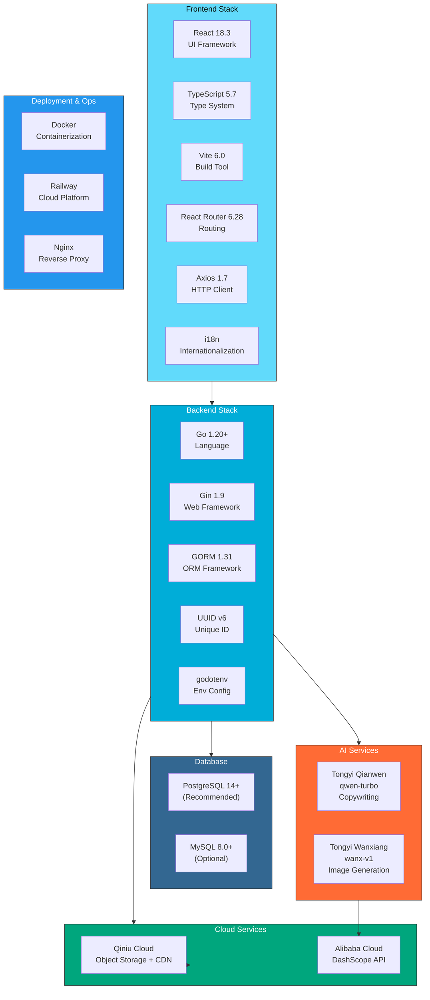
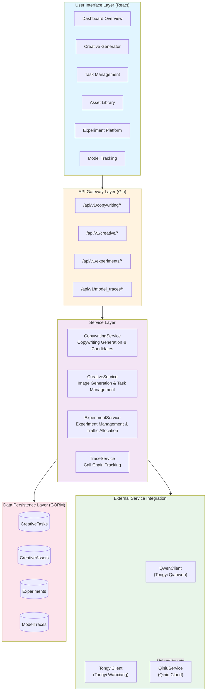
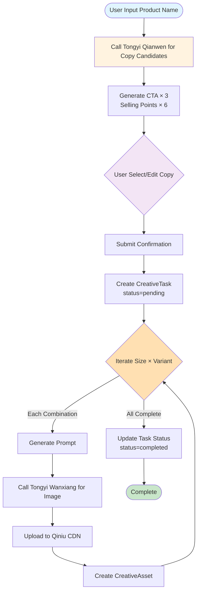
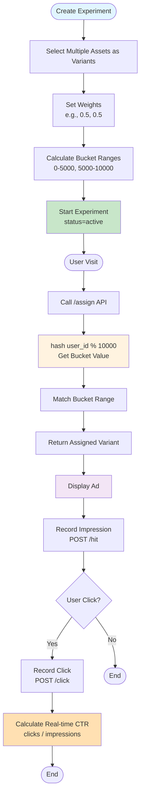
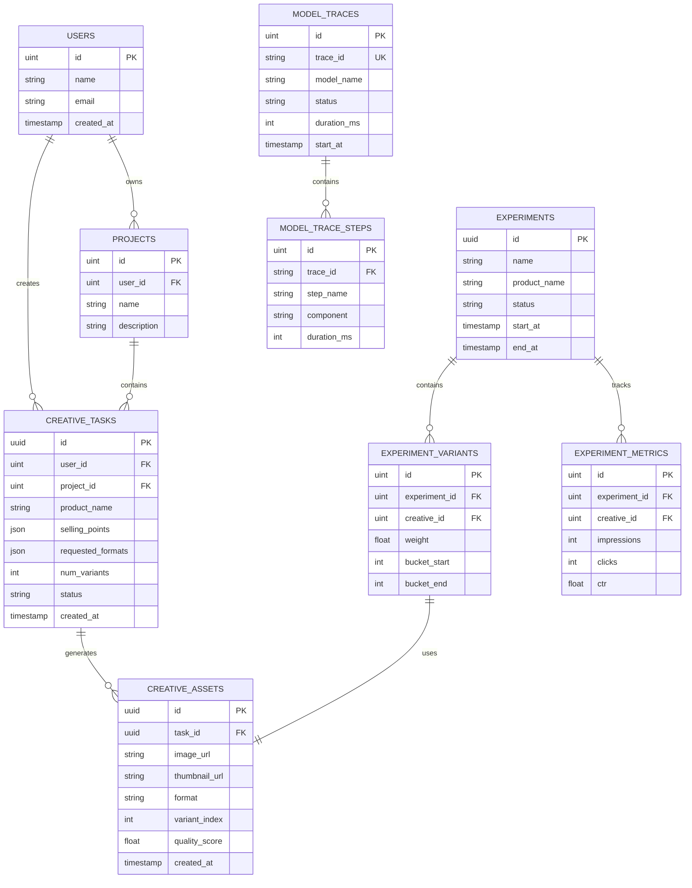
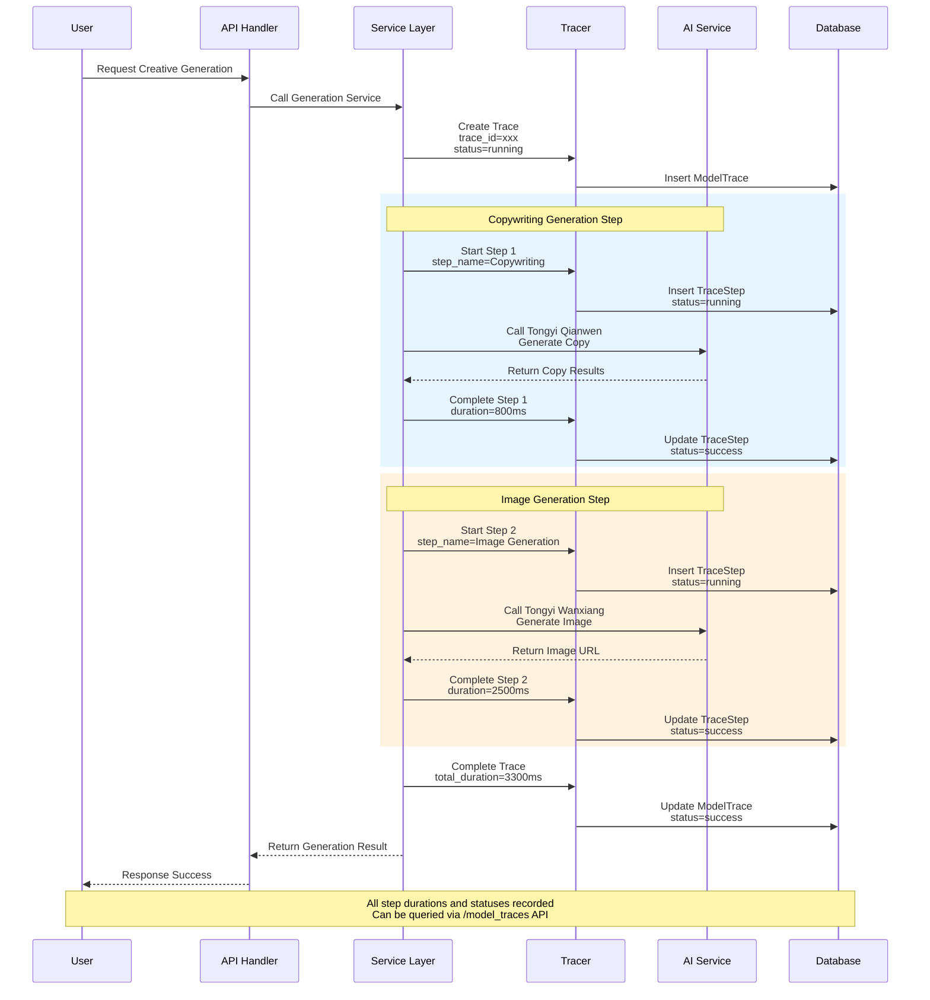

# LLM/VLM/Text-to-Image Based Advertising Creative Generation and Experimentation Platform

**Language / 语言**: English | [简体中文](README_CN.md)

An intelligent advertising creative generation platform based on Alibaba Cloud Tongyi Wanxiang and Tongyi Qianwen, providing a complete workflow from copywriting to image creation, with A/B testing, model tracking, and plugin-based deployment support.

[](https://go.dev/)
[](https://reactjs.org/)
[](https://www.typescriptlang.org/)
[](https://www.postgresql.org/)


## Table of Contents

- [Core Features](#core-features)
- [Technology Architecture](#technology-architecture)
- [System Architecture](#system-architecture)
- [Project Structure](#project-structure)
- [Quick Start](#quick-start)
- [Environment Configuration](#environment-configuration)
- [Deployment Guide](#deployment-guide)
- [API Reference](#api-reference)
- [Development Guide](#development-guide)

## Core Features

### 1. Intelligent Creative Generation Workflow

Complete creative generation pipeline from copywriting to images:

- **AI Copywriting** - Automatically generate CTAs and multiple selling point candidates based on Tongyi Qianwen
- **Copywriting Confirmation** - User selects or customizes copy before triggering image generation
- **AI Image Generation** - Integrated Tongyi Wanxiang for professional advertising creative images
- **Multi-size Support** - Supports 1:1, 9:16, 16:9, and other advertising formats
- **Variant Generation** - Generate multiple creative variants at once for selection and comparison
- **Custom Prompts** - Support customized generation prompts and styles for each variant

### 2. A/B Testing Platform

Powerful experiment management and performance evaluation system:

- **Experiment Creation** - Create comparison experiments by selecting creatives from the asset library
- **Smart Traffic Allocation** - Bucket mechanism based on user ID hash (0-10000)
- **Weight Configuration** - Flexible variant traffic allocation weight settings
- **Real-time Metrics** - Real-time statistics of impressions, clicks, and CTR
- **Online Usage** - Allocate variants and record metrics via API
- **Local Preview** - Support embedded plugin preview of experiment effects

### 3. Task Management System

Complete task lifecycle management:

- **Task Status Tracking** - pending → queued → processing → completed/failed
- **Progress Visualization** - Real-time display of task processing progress (0-100%)
- **Batch Generation** - Support simultaneous generation of multiple sizes and variants
- **Task Deletion** - Support deletion of tasks and associated assets
- **First Image Preview** - Quick preview of the first generated asset in task list

### 4. Asset Management

Centralized creative asset library:

- **Paginated Browse** - Efficient pagination loading mechanism
- **Format Filtering** - Filter assets by size (1:1, 9:16, 16:9)
- **Quality Scoring** - CTR prediction, NSFW detection, comprehensive quality scoring
- **Cloud Storage** - Automatic upload to Qiniu Cloud CDN
- **Metadata Management** - Record complete information including copy, selling points, generation parameters

### 5. Model Call Tracking

Complete call chain tracking for AI models:

- **Call Chain Records** - Record complete information for each AI model call
- **Step Breakdown** - Detailed breakdown into copywriting generation, image generation, and other steps
- **Performance Monitoring** - Track duration (ms) for each step
- **Status Tracking** - success/failed/running status markers
- **Input/Output Preview** - Record request parameters and response result preview
- **Error Diagnosis** - Record detailed error information on failure

### 6. Plugin-based Deployment

Plugin system that can be embedded in third-party applications:

- **Independent Component** - `experiment-widget.js` can be embedded in any web page
- **Local Preview** - Plugin preview page simulates real usage scenarios
- **Dynamic Loading** - Update experiment configuration without redeployment
- **i18n Support** - Chinese and English bilingual interface switching

## Technology Architecture

### Technology Stack Overview

The project adopts a modern full-stack technology architecture with React + TypeScript frontend, Go + Gin backend, and integration with Alibaba Cloud AI services.



### Backend Technology Stack

```
Go 1.20+
├── Web Framework: Gin 1.9
├── ORM: GORM 1.31
├── Database Drivers:
│   ├── gorm.io/driver/postgres (PostgreSQL)
│   └── gorm.io/driver/mysql (MySQL)
├── UUID: github.com/google/uuid
└── Env Config: github.com/joho/godotenv
```

**Core Dependencies:**
- **Gin** - High-performance HTTP web framework
- **GORM** - Powerful ORM library supporting multiple databases
- **UUID v6** - Generate unique identifiers

### Frontend Technology Stack

```
React 18.3 + TypeScript 5.7 + Vite 6.0
├── UI Framework: React 18.3.1
├── Type System: TypeScript 5.7.2
├── Build Tool: Vite 6.0.5
├── Routing: React Router 6.28.0
├── HTTP Client: Axios 1.7.9
└── i18n: Custom i18n solution
```

**Page Routes:**
- `/` - Dashboard Overview
- `/creative` - Creative Generator
- `/tasks` - Task List
- `/assets` - Asset Library
- `/experiments` - Experiment Management
- `/experiments/new` - Create Experiment
- `/traces` - Model Tracking
- `/plugin-preview` - Plugin Preview

### Third-party Services

**AI Services:**
- **Alibaba Cloud Tongyi Wanxiang (wanx-v1)** - Text-to-image model
- **Alibaba Cloud Tongyi Qianwen (qwen-turbo)** - Large language model

**Cloud Services:**
- **Qiniu Cloud Object Storage** - CDN-accelerated asset storage
- **PostgreSQL/MySQL** - Relational databases

## System Architecture

### Business Architecture Diagram

The system adopts a layered architecture design, from top to bottom: user interface layer, API gateway layer, service layer, external service integration layer, and data persistence layer.



### Core Workflows

#### 1. Creative Generation Flow

Complete workflow from copywriting to image generation, including user confirmation and multi-variant concurrent generation mechanism.



#### 2. A/B Testing Flow

Traffic allocation mechanism based on hash bucketing, supporting real-time metric statistics and CTR calculation.



### Database Design

**Core Data Tables:**

```sql
-- Creative Tasks Table
creative_tasks
├── id (UUID Primary Key)
├── user_id (User ID)
├── product_name (Product Name)
├── cta_text (CTA Copy)
├── selling_points (Selling Points JSON Array)
├── cta_candidates (CTA Candidates JSON)
├── selling_point_candidates (Selling Point Candidates JSON)
├── requested_formats (Requested Sizes JSON)
├── num_variants (Number of Variants)
├── variant_prompts (Variant Prompts JSON)
├── variant_styles (Variant Styles JSON)
├── status (Task Status)
├── progress (Progress 0-100)
├── first_asset_url (First Image Preview)
└── timestamps (Timestamps)

-- Creative Assets Table
creative_assets
├── id (UUID Primary Key)
├── task_id (Task ID, Foreign Key)
├── image_url (Image URL)
├── thumbnail_url (Thumbnail URL)
├── format (Size Specification)
├── variant_index (Variant Index)
├── prompt_used (Generation Prompt)
├── style_used (Style Used)
├── quality_score (Quality Score)
├── predicted_ctr (Predicted CTR)
├── nsfw_score (NSFW Score)
└── timestamps

-- Experiments Table
experiments
├── id (UUID Primary Key)
├── name (Experiment Name)
├── product_name (Product Name)
├── status (Experiment Status: draft/active/paused/archived)
├── start_at (Start Time)
├── end_at (End Time)
└── timestamps

-- Experiment Variants Table
experiment_variants
├── id (Auto-increment Primary Key)
├── experiment_id (Experiment ID, Foreign Key)
├── creative_id (Asset ID)
├── weight (Weight 0-1)
├── bucket_start (Bucket Start 0-10000)
├── bucket_end (Bucket End 0-10000)
├── title, product_name, image_url, cta_text, selling_points
└── timestamps

-- Experiment Metrics Table
experiment_metrics
├── id (Auto-increment Primary Key)
├── experiment_id (Experiment ID)
├── creative_id (Asset ID)
├── impressions (Impression Count)
├── clicks (Click Count)
├── ctr (Click-through Rate)
└── updated_at

-- Model Traces Table
model_traces
├── id (Auto-increment Primary Key)
├── trace_id (Trace ID, Unique Index)
├── model_name (Model Name)
├── model_version (Model Version)
├── product_name (Product Name)
├── status (Status: success/failed/running)
├── duration_ms (Duration in ms)
├── start_at, end_at (Time Range)
├── source (Source: experiment/task/user)
├── input_preview (Input Preview)
├── output_preview (Output Preview)
├── error_message (Error Message)
└── timestamps

-- Model Trace Steps Table
model_trace_steps
├── id (Auto-increment Primary Key)
├── trace_id (Trace ID, Foreign Key)
├── step_name (Step Name)
├── component (Component Name)
├── status (Status)
├── duration_ms (Duration in ms)
├── start_at, end_at
├── input_preview, output_preview
├── error_message
├── extra (Extended Info JSON)
└── timestamps
```

**Index Strategy:**
- `creative_tasks`: status, user_id, created_at
- `creative_assets`: task_id, format, created_at
- `experiments`: status, created_at
- `experiment_variants`: experiment_id, creative_id
- `experiment_metrics`: experiment_id, creative_id
- `model_traces`: trace_id (unique), model_name, product_name, status

#### Database ER Diagram

Showing the relationships between core tables.



### Model Call Tracking Sequence Diagram

Showing the complete call chain tracking process for AI model calls, from request initiation to response recording.



## Project Structure

```
ads-creative-gen-platform/
├── cmd/                          # CLI Tools
│   └── migrate/                 # Database Migration Tool
│       └── main.go              # Migration Script Entry
│
├── config/                      # Configuration Management
│   ├── config.go                # Configuration Loader
│   └── sql/                     # SQL Migration Files
│
├── internal/                    # Internal Packages (Not Exposed)
│   ├── handlers/                # HTTP Handlers (Controller Layer)
│   │   ├── creative_handler.go  # Creative Generation API
│   │   ├── experiment_handler.go # Experiment Management API
│   │   ├── trace_handler.go     # Model Tracking API
│   │   └── dto.go               # Data Transfer Objects
│   │
│   ├── services/                # Business Logic Layer (Service Layer)
│   │   ├── copywriting_service.go  # Copywriting Service
│   │   ├── creative_service.go     # Creative Service
│   │   ├── experiment_service.go   # Experiment Service
│   │   ├── qwen_client.go          # Tongyi Qianwen Client
│   │   ├── tongyi_client.go        # Tongyi Wanxiang Client
│   │   ├── qiniu_service.go        # Qiniu Cloud Service
│   │   └── delete_task.go          # Task Deletion Service
│   │
│   ├── models/                  # Data Models (Model Layer)
│   │   ├── base.go              # Base Models (UUIDModel, Timestamps)
│   │   ├── creative.go          # Creative Models
│   │   ├── experiment.go        # Experiment Models
│   │   ├── trace.go             # Trace Models
│   │   ├── user.go              # User Model
│   │   ├── project.go           # Project Model
│   │   └── tag.go               # Tag Model
│   │
│   ├── middleware/              # Middleware
│   │   └── cors.go              # CORS Configuration
│   │
│   └── tracing/                 # Tracing System
│       ├── tracer.go            # Tracer
│       └── trace_service.go     # Trace Service
│
├── pkg/                         # Public Packages (Can be Exposed)
│   └── database/                # Database Connection Layer
│       └── database.go          # Database Initialization
│
├── web/                         # React Frontend Project
│   ├── src/
│   │   ├── pages/              # Page Components
│   │   │   ├── DashboardPage.tsx          # Home Page
│   │   │   ├── CreativeGeneratorPage.tsx  # Creative Generation Page
│   │   │   ├── TasksPage.tsx              # Task List Page
│   │   │   ├── AssetsPage.tsx             # Asset Library Page
│   │   │   ├── ExperimentsPage.tsx        # Experiment List Page
│   │   │   ├── ExperimentCreatePage.tsx   # Create Experiment Page
│   │   │   ├── TracePage.tsx              # Model Tracking Page
│   │   │   └── PluginPreviewPage.tsx      # Plugin Preview Page
│   │   │
│   │   ├── components/         # Reusable Components
│   │   ├── services/           # API Clients
│   │   ├── types/              # TypeScript Type Definitions
│   │   ├── i18n.tsx            # i18n Configuration
│   │   ├── App.tsx             # Application Entry
│   │   └── main.tsx            # Render Entry
│   │
│   ├── public/
│   │   └── experiment-widget.js # Experiment Plugin Script
│   │
│   ├── dist/                   # Build Artifacts (Hosted by Backend)
│   ├── package.json
│   ├── tsconfig.json
│   └── vite.config.js
│
├── docs/                       # Documentation Center
│   ├── README.md               # Documentation Index
│   ├── api-reference.md        # API Reference
│   ├── database.md             # Database Design Docs
│   ├── database-schema.sql     # Database Schema
│   ├── guides/                 # Guide Documentation
│   │   ├── development.md      # Development Guide
│   │   └── deployment.md       # Deployment Guide
│   └── design/                 # Feature Design Docs
│       ├── copywriting-feature.md
│       ├── experiment-feature.md
│       ├── model-trace-page.md
│       └── plugin-widget.md
│
├── scripts/                    # Management Scripts
│   ├── start.sh               # Start Service
│   ├── stop.sh                # Stop Service
│   └── status.sh              # Check Status
│
├── main.go                    # Program Entry
├── Dockerfile                 # Docker Image Configuration (Multi-stage Build)
├── .env.example              # Environment Variable Template
├── go.mod                    # Go Dependency Management
└── go.sum                    # Go Dependency Lock
```

**Directory Design Principles:**
- **cmd/** - Executable program entry points
- **internal/** - Private code, not exposed externally
- **pkg/** - Reusable public libraries
- **web/** - Frontend project, completely independent
- **docs/** - Project documentation centralized management
- **scripts/** - Operations scripts

## Quick Start

### Requirements

**Required:**
- **Go**: 1.20 or higher
- **Node.js**: 18 or higher
- **Database**: PostgreSQL 14+ or MySQL 8.0+

**Optional:**
- **Docker**: For containerized deployment
- **Make**: For running Makefile commands

### 1. Clone Repository

```bash
git clone <your-repo-url>
cd ads-creative-gen-platform
```

### 2. Configure Environment Variables

```bash
# Copy environment variable template
cp .env.example .env

# Edit configuration file (use your preferred editor)
vim .env  # or nano .env
```

**Required Configuration:**

```bash
# Application Configuration
APP_MODE=debug              # debug: development mode, release: production mode
HTTP_PORT=:4000             # HTTP service port

# Database Configuration (PostgreSQL example)
DB_TYPE=postgres            # postgres or mysql
DB_HOST=localhost
DB_PORT=5432
DB_USER=postgres
DB_PASSWORD=your_password
DB_NAME=ads_creative_gen_platform
DB_CHARSET=utf8

# Tongyi API Configuration
TONGYI_API_KEY=sk-xxxxx    # Alibaba Cloud DashScope API Key
TONGYI_IMAGE_MODEL=wanx-v1  # Image generation model
TONGYI_LLM_MODEL=qwen-turbo # Copywriting generation model

# Qiniu Cloud Configuration
QINIU_ACCESS_KEY=your_access_key
QINIU_SECRET_KEY=your_secret_key
QINIU_BUCKET=your_bucket_name
QINIU_DOMAIN=               # Optional: Custom domain
QINIU_PUBLIC_CLOUD_DOMAIN=  # Optional: Public cloud domain
QINIU_REGION=cn-south-1     # Storage region
QINIU_BASE_PATH=s3/         # Storage path prefix
```

**Get API Keys:**
- **Tongyi API Key**: [Alibaba Cloud DashScope Console](https://dashscope.console.aliyun.com/)
- **Qiniu Cloud Keys**: [Qiniu Cloud Key Management](https://portal.qiniu.com/user/key)

### 3. Initialize Database

**PostgreSQL:**

```bash
# Create database
psql -U postgres -c "CREATE DATABASE ads_creative_gen_platform;"

# Run database migration
go run cmd/migrate/main.go -action migrate

# (Optional) Add default data
go run cmd/migrate/main.go -action seed
```

**Migration Command Description:**
- `migrate` - Create/update table structure (safe, won't delete data)
- `seed` - Add default data (admin account, tags, etc.)
- `reset` - ⚠️ Reset database (delete all data and reinitialize)

### 4. Start Backend Service

```bash
# Install Go dependencies
go mod download

# Start service
go run main.go
```

On success, you'll see:

```
🚀 Server starting on :4000
📖 API Docs: http://localhost:4000/api/v1/ping
💚 Health Check: http://localhost:4000/health
```

### 5. Build and Start Frontend

**Development Mode (Recommended):**

```bash
cd web

# Install dependencies
npm install

# Start development server (hot reload)
npm run dev
```

Frontend will run on `http://localhost:3001`

**Production Mode:**

```bash
cd web

# Install dependencies
npm install

# Build frontend
npm run build
```

Build artifacts will be generated in `web/dist/`, then access the backend service at `http://localhost:4000`.

### 6. Access Application

**Development Mode (Frontend-Backend Separated):**
- Frontend: http://localhost:3001
- Backend API: http://localhost:4000/api/v1
- Health Check: http://localhost:4000/health

**Production Mode (Frontend-Backend Integrated):**
- Application Home: http://localhost:4000
- API Endpoints: http://localhost:4000/api/v1
- Health Check: http://localhost:4000/health

### 7. Use Management Scripts (Optional)

The project provides convenient management scripts:

```bash
# Start service (auto-check database, run migrations)
./scripts/start.sh

# Stop service
./scripts/stop.sh

# Check service status
./scripts/status.sh
```

## Environment Configuration

### Complete Environment Variable Description

```bash
# ==========================================
# Application Configuration
# ==========================================
APP_MODE=debug              # debug: development mode, release: production mode
HTTP_PORT=:4000             # HTTP service port (format: :port)

# ==========================================
# Database Configuration
# ==========================================
DB_TYPE=postgres            # Database type: postgres or mysql
DB_HOST=localhost           # Database host
DB_PORT=5432                # Database port (PostgreSQL: 5432, MySQL: 3306)
DB_USER=postgres            # Database username
DB_PASSWORD=your_password   # Database password
DB_NAME=ads_creative_gen_platform  # Database name
DB_CHARSET=utf8             # Character set (MySQL: utf8mb4, PostgreSQL: utf8)

# ==========================================
# Alibaba Cloud Tongyi API Configuration
# ==========================================
TONGYI_API_KEY=sk-xxxxx     # DashScope API Key
TONGYI_IMAGE_MODEL=wanx-v1  # Image generation model: wanx-v1, wanx-lite-v1
TONGYI_LLM_MODEL=qwen-turbo # Copywriting model: qwen-turbo, qwen-plus, qwen-max

# ==========================================
# Qiniu Cloud Storage Configuration
# ==========================================
QINIU_ACCESS_KEY=your_access_key  # Qiniu AccessKey
QINIU_SECRET_KEY=your_secret_key  # Qiniu SecretKey
QINIU_BUCKET=your_bucket_name     # Bucket name
QINIU_DOMAIN=                     # Custom CDN domain (optional)
QINIU_PUBLIC_CLOUD_DOMAIN=        # Public cloud default domain (optional)
QINIU_REGION=cn-south-1           # Storage region: cn-south-1 (South China), cn-east-2 (East China)
QINIU_BASE_PATH=s3/               # Storage path prefix
```

### Database Switching

**Using PostgreSQL (Recommended):**

```bash
DB_TYPE=postgres
DB_HOST=localhost
DB_PORT=5432
DB_USER=postgres
DB_PASSWORD=postgres
DB_NAME=ads_creative_gen_platform
DB_CHARSET=utf8
```

## Deployment Guide

### Method 1: Docker Deployment (Recommended)

The project provides a multi-stage build Dockerfile for integrated frontend-backend deployment.

**Build Image:**

```bash
# Build Docker image
docker build -t ads-creative-gen-platform:latest .

# Run container
docker run -d \
  --name ads-platform \
  -p 4000:4000 \
  --env-file .env \
  ads-creative-gen-platform:latest

# View logs
docker logs -f ads-platform
```

**Docker Multi-stage Build Flow:**

Showing the complete process of frontend-backend separated build, ultimately integrated into a single runtime image.

```mermaid
graph LR
    subgraph Stage1["Stage 1: Frontend Build"]
        S1_Base["Node.js 20 Alpine"]
        S1_Copy["Copy package.json"]
        S1_Install["npm ci install deps"]
        S1_Build["npm run build"]
        S1_Output["web/dist/"]

        S1_Base --> S1_Copy --> S1_Install --> S1_Build --> S1_Output
    end

    subgraph Stage2["Stage 2: Backend Build"]
        S2_Base["Go 1.22 Alpine"]
        S2_Deps["go mod download"]
        S2_CopyFront["Copy frontend artifacts"]
        S2_Build["go build"]
        S2_Output["main binary"]

        S2_Base --> S2_Deps --> S2_CopyFront --> S2_Build --> S2_Output
    end

    subgraph Stage3["Stage 3: Runtime"]
        S3_Base["Alpine Latest"]
        S3_Runtime["Install runtime deps<br/>ca-certificates, tzdata"]
        S3_Copy["Copy main + web/dist/"]
        S3_User["Create non-root user"]
        S3_Final["Final image<br/>~50MB"]

        S3_Base --> S3_Runtime --> S3_Copy --> S3_User --> S3_Final
    end

    S1_Output -.->|Copy to Stage 2| S2_CopyFront
    S1_Output -.->|Copy to Stage 3| S3_Copy
    S2_Output -.->|Copy to Stage 3| S3_Copy

    style Stage1 fill:#e3f2fd
    style Stage2 fill:#f3e5f5
    style Stage3 fill:#e8f5e9
    style S3_Final fill:#c8e6c9,stroke:#4caf50,stroke-width:3px
```



**Advantages:**
- ✅ Small image size (~50MB)
- ✅ High security (non-root user)
- ✅ Automatic multi-stage build
- ✅ Includes health checks
- ✅ Integrated frontend-backend deployment

### Method 2: Cloud Platform Deployment

#### Railway

Railway is a zero-config cloud deployment platform.

```bash
# 1. Install Railway CLI
npm install -g @railway/cli

# 2. Login
railway login

# 3. Initialize project
railway init

# 4. Deploy
railway up
```

#### Render

Render supports automatic deployment from Dockerfile.

**Steps:**
1. Create a new Web Service on Render
2. Connect GitHub repository
3. Select Dockerfile build
4. Configure environment variables
5. Click deploy

## API Reference

### Authentication

Current version doesn't implement authentication, all endpoints are directly accessible.

### Base Endpoints

#### Health Check

```http
GET /health
```

**Response:**

```json
{
  "status": "ok",
  "service": "ads-creative-platform"
}
```

#### Ping

```http
GET /api/v1/ping
```

**Response:**

```json
{
  "message": "pong"
}
```

### Copywriting Generation Endpoints

#### Generate Copy Candidates

```http
POST /api/v1/copywriting/generate
Content-Type: application/json

{
  "product_name": "Summer Cool T-shirt"
}
```

**Response:**

```json
{
  "cta_candidates": [
    "Buy Now",
    "Shop Now",
    "Limited Time Offer"
  ],
  "selling_point_candidates": [
    "Pure cotton, breathable, cool all summer",
    "Sweat-wicking, comfortable, seamless",
    "Classic design, versatile fashion",
    "Premium fabric, skin-friendly softness",
    "Summer essential, refreshing companion",
    "Multiple colors, show your personality"
  ]
}
```

#### Confirm Copy and Start Creative Generation

```http
POST /api/v1/copywriting/confirm
Content-Type: application/json

{
  "product_name": "Summer Cool T-shirt",
  "cta": "Buy Now",
  "selling_point": "Pure cotton, breathable, cool all summer",
  "requested_formats": ["1:1", "9:16", "16:9"],
  "num_variants": 3,
  "selected_cta_index": 0,
  "selected_sp_indexes": [0, 1]
}
```

**Response:**

```json
{
  "task_id": "550e8400-e29b-41d4-a716-446655440000",
  "status": "pending",
  "message": "Task created, starting creative generation"
}
```

### Creative Generation Endpoints

#### Direct Creative Generation (Skip Copywriting)

```http
POST /api/v1/creative/generate
Content-Type: application/json

{
  "title": "Summer T-shirt Promotion",
  "product_name": "Summer Cool T-shirt",
  "selling_points": ["Pure cotton breathable", "Sweat-wicking"],
  "cta_text": "Buy Now",
  "requested_formats": ["1:1", "9:16"],
  "num_variants": 2
}
```

**Response:**

```json
{
  "task_id": "550e8400-e29b-41d4-a716-446655440000",
  "status": "pending"
}
```

#### Query Task Status

```http
GET /api/v1/creative/task/{task_id}
```

**Response:**

```json
{
  "id": "550e8400-e29b-41d4-a716-446655440000",
  "title": "Summer T-shirt Promotion",
  "product_name": "Summer Cool T-shirt",
  "status": "completed",
  "progress": 100,
  "requested_formats": ["1:1", "9:16"],
  "num_variants": 2,
  "first_asset_url": "https://cdn.example.com/xxx.jpg",
  "assets": [
    {
      "id": "asset-uuid-1",
      "image_url": "https://cdn.example.com/xxx.jpg",
      "thumbnail_url": "https://cdn.example.com/xxx_thumb.jpg",
      "format": "1:1",
      "variant_index": 0,
      "quality_score": 0.85,
      "predicted_ctr": 0.12
    }
  ],
  "created_at": "2024-12-15T10:00:00Z",
  "completed_at": "2024-12-15T10:02:30Z"
}
```

**Task Status:**
- `draft` - Draft (copywriting only)
- `pending` - Pending
- `queued` - Queued
- `processing` - Processing
- `completed` - Completed
- `failed` - Failed
- `cancelled` - Cancelled

#### Get Task List

```http
GET /api/v1/creative/tasks?page=1&page_size=10
```

**Response:**

```json
{
  "tasks": [...],
  "pagination": {
    "page": 1,
    "page_size": 10,
    "total": 50
  }
}
```

#### Delete Task

```http
DELETE /api/v1/creative/task/{task_id}
```

**Response:**

```json
{
  "message": "Task and associated assets deleted"
}
```

### Asset Management Endpoints

#### Get Asset List

```http
GET /api/v1/creative/assets?page=1&page_size=20&format=1:1
```

**Query Parameters:**
- `page` - Page number (default 1)
- `page_size` - Items per page (default 20)
- `format` - Size filter (optional: 1:1, 9:16, 16:9)

**Response:**

```json
{
  "assets": [...],
  "pagination": {
    "page": 1,
    "page_size": 20,
    "total": 100
  }
}
```

### Experiment Management Endpoints

#### Create Experiment

```http
POST /api/v1/experiments
Content-Type: application/json

{
  "name": "Summer T-shirt Ad Test",
  "product_name": "Summer Cool T-shirt",
  "variants": [
    {
      "creative_id": 1,
      "weight": 0.5
    },
    {
      "creative_id": 2,
      "weight": 0.5
    }
  ]
}
```

**Response:**

```json
{
  "id": "exp-uuid",
  "name": "Summer T-shirt Ad Test",
  "status": "draft",
  "variants": [
    {
      "id": 1,
      "creative_id": 1,
      "weight": 0.5,
      "bucket_start": 0,
      "bucket_end": 5000
    },
    {
      "id": 2,
      "creative_id": 2,
      "weight": 0.5,
      "bucket_start": 5000,
      "bucket_end": 10000
    }
  ]
}
```

#### Get Experiment List

```http
GET /api/v1/experiments?page=1&page_size=10
```

#### Update Experiment Status

```http
POST /api/v1/experiments/{id}/status
Content-Type: application/json

{
  "status": "active"
}
```

**Status Values:**
- `draft` - Draft
- `active` - Running
- `paused` - Paused
- `archived` - Archived

#### Assign Variant (Traffic Allocation)

```http
GET /api/v1/experiments/{id}/assign?user_id=user123
```

**Response:**

```json
{
  "variant_id": 1,
  "creative_id": 1,
  "title": "Summer Cool T-shirt",
  "product_name": "Summer Cool T-shirt",
  "image_url": "https://cdn.example.com/xxx.jpg",
  "cta_text": "Buy Now",
  "selling_points": ["Pure cotton breathable", "Sweat-wicking"]
}
```

**Traffic Allocation Algorithm:**
```
bucket = hash(user_id) % 10000
Match variant with bucket_start <= bucket < bucket_end
```

#### Record Impression

```http
POST /api/v1/experiments/{id}/hit
Content-Type: application/json

{
  "user_id": "user123",
  "variant_id": 1
}
```

**Response:**

```json
{
  "message": "Impression recorded"
}
```

#### Record Click

```http
POST /api/v1/experiments/{id}/click
Content-Type: application/json

{
  "user_id": "user123",
  "variant_id": 1
}
```

**Response:**

```json
{
  "message": "Click recorded"
}
```

#### View Experiment Metrics

```http
GET /api/v1/experiments/{id}/metrics
```

**Response:**

```json
{
  "experiment_id": "exp-uuid",
  "metrics": [
    {
      "creative_id": 1,
      "impressions": 10000,
      "clicks": 500,
      "ctr": 0.05
    },
    {
      "creative_id": 2,
      "impressions": 10000,
      "clicks": 600,
      "ctr": 0.06
    }
  ]
}
```

### Model Tracking Endpoints

#### Get Trace List

```http
GET /api/v1/model_traces?page=1&page_size=10
```

**Response:**

```json
{
  "traces": [...],
  "pagination": {
    "page": 1,
    "page_size": 10,
    "total": 50
  }
}
```

#### Get Trace Details

```http
GET /api/v1/model_traces/{id}
```

**Response:**

```json
{
  "id": 1,
  "trace_id": "trace-uuid",
  "model_name": "Tongyi Qianwen",
  "model_version": "qwen-turbo",
  "product_name": "Summer Cool T-shirt",
  "status": "success",
  "duration_ms": 1500,
  "start_at": "2024-12-15T10:00:00Z",
  "end_at": "2024-12-15T10:00:01.5Z",
  "steps": [
    {
      "step_name": "Copywriting Generation",
      "component": "QwenClient",
      "status": "success",
      "duration_ms": 800,
      "input_preview": "Product name: Summer Cool T-shirt",
      "output_preview": "CTA: Buy Now; Selling points: ..."
    }
  ]
}
```

## Development Guide

### Backend Development

#### Project Structure Conventions

- **handlers/** - Only responsible for HTTP request/response handling, no business logic
- **services/** - Core business logic layer, can be reused by multiple handlers
- **models/** - Data model definitions using GORM tags
- **pkg/** - Reusable public libraries (such as database connections)

#### Adding New Endpoints

**1. Define Data Model (internal/models/)**

```go
package models

type MyModel struct {
    UUIDModel
    Name   string `gorm:"type:varchar(255);not null" json:"name"`
    Status string `gorm:"type:varchar(20);default:'active'" json:"status"`
}

func (MyModel) TableName() string {
    return "my_models"
}
```

**2. Create Service Layer (internal/services/)**

```go
package services

type MyService struct {
    db *gorm.DB
}

func NewMyService() *MyService {
    return &MyService{db: database.DB}
}

func (s *MyService) Create(data *models.MyModel) error {
    return s.db.Create(data).Error
}
```

**3. Create Handler (internal/handlers/)**

```go
package handlers

type MyHandler struct {
    service *services.MyService
}

func NewMyHandler() *MyHandler {
    return &MyHandler{
        service: services.NewMyService(),
    }
}

func (h *MyHandler) Create(c *gin.Context) {
    var req dto.CreateMyModelRequest
    if err := c.ShouldBindJSON(&req); err != nil {
        c.JSON(400, gin.H{"error": err.Error()})
        return
    }

    // Call service layer
    model := &models.MyModel{Name: req.Name}
    if err := h.service.Create(model); err != nil {
        c.JSON(500, gin.H{"error": err.Error()})
        return
    }

    c.JSON(200, model)
}
```

**4. Register Routes (main.go)**

```go
myHandler := handlers.NewMyHandler()
v1.POST("/my-models", myHandler.Create)
v1.GET("/my-models/:id", myHandler.Get)
```

#### Database Migration

**Auto Migration (Development):**

Add model in `pkg/database/database.go`:

```go
func InitializeDatabase() {
    // ...
    DB.AutoMigrate(
        &models.MyModel{}, // Add new model
    )
}
```

**Manual Migration (Production):**

Add in `cmd/migrate/main.go`:

```go
func migrate() {
    database.DB.AutoMigrate(&models.MyModel{})
    log.Println("✅ MyModel table migrated")
}
```

Then run:

```bash
go run cmd/migrate/main.go -action migrate
```

### Frontend Development

#### Project Structure Conventions

- **pages/** - Page components (one route corresponds to one page)
- **components/** - Reusable components
- **services/** - API client wrappers
- **types/** - TypeScript type definitions

#### Adding New Pages

**1. Create Page Component (src/pages/MyPage.tsx)**

```tsx
import React from 'react';

const MyPage: React.FC = () => {
  return (
    <div>
      <h1>My Page</h1>
    </div>
  );
};

export default MyPage;
```

**2. Register Route (src/App.tsx)**

```tsx
import MyPage from './pages/MyPage';

<Routes>
  <Route path="/my-page" element={<MyPage />} />
</Routes>
```

#### API Calls

**1. Define Types (src/types/index.ts)**

```typescript
export interface MyModel {
  id: string;
  name: string;
  status: string;
  created_at: string;
}
```

**2. Create API Service (src/services/api.ts)**

```typescript
import axios from 'axios';
import { MyModel } from '../types';

const API_BASE = '/api/v1';

export const myApi = {
  create: async (data: { name: string }): Promise<MyModel> => {
    const res = await axios.post(`${API_BASE}/my-models`, data);
    return res.data;
  },

  get: async (id: string): Promise<MyModel> => {
    const res = await axios.get(`${API_BASE}/my-models/${id}`);
    return res.data;
  },
};
```

**3. Use in Component**

```tsx
import { useEffect, useState } from 'react';
import { myApi } from '../services/api';
import { MyModel } from '../types';

const MyPage: React.FC = () => {
  const [data, setData] = useState<MyModel | null>(null);

  useEffect(() => {
    myApi.get('some-id').then(setData);
  }, []);

  return <div>{data?.name}</div>;
};
```

#### Internationalization

Use the project's built-in i18n system:

```tsx
import { useI18n } from '../i18n';

const MyComponent: React.FC = () => {
  const { t, setLanguage } = useI18n();

  return (
    <div>
      <h1>{t('myPage.title')}</h1>
      <button onClick={() => setLanguage('en')}>English</button>
      <button onClick={() => setLanguage('zh')}>中文</button>
    </div>
  );
};
```

Add translations in `src/i18n.tsx`:

```typescript
const translations = {
  zh: {
    myPage: {
      title: '我的页面',
    },
  },
  en: {
    myPage: {
      title: 'My Page',
    },
  },
};
```

### Code Standards

**Go Code Standards:**
- Follow [Effective Go](https://golang.org/doc/effective_go.html)
- Use `gofmt` to format code
- Add comments for exported functions and types
- Don't ignore error handling

**TypeScript Code Standards:**
- Use strict mode (`strict: true`)
- Use functional components + Hooks
- Avoid using `any`, define types as much as possible
- Use ESLint and Prettier for formatting

### Testing

**Backend Testing:**

```bash
# Run all tests
go test ./...

# Run tests for specific package
go test ./internal/services

# With coverage
go test -cover ./...
```

**Frontend Testing:**

```bash
cd web

# Type checking
npx tsc --noEmit

# (Optional) Add unit test framework like Vitest
npm run test
```

### Common Issues

#### 1. Database Connection Failed

**Problem:** Database connection failure on startup

**Solution:**
```bash
# Check if database is running
# PostgreSQL
pg_isready

# MySQL
mysqladmin ping

# Check environment variables
cat .env | grep DB_

# Test connection
psql -h localhost -U postgres -d ads_creative_gen_platform
```

#### 2. Frontend 404

**Problem:** Frontend pages return 404

**Solution:**
```bash
# Ensure frontend is built
cd web && npm run build

# Check dist directory
ls -la web/dist/

# Restart backend
go run main.go
```

#### 3. Tongyi API Call Failed

**Problem:** Error "API Key invalid" when generating creatives

**Solution:**
```bash
# Check API Key
echo $TONGYI_API_KEY

# Verify API Key validity
curl -X POST 'https://dashscope.aliyuncs.com/api/v1/services/aigc/text-generation/generation' \
  -H "Authorization: Bearer $TONGYI_API_KEY" \
  -H 'Content-Type: application/json' \
  -d '{
    "model": "qwen-turbo",
    "input": {"prompt": "Hello"},
    "parameters": {}
  }'
```

#### 4. Qiniu Cloud Upload Failed

**Problem:** Image upload to Qiniu Cloud fails after generation

**Solution:**
```bash
# Check Qiniu Cloud configuration
cat .env | grep QINIU_

# Ensure Bucket exists and has permissions
# Check storage region configuration (cn-south-1, cn-east-2, etc.)
# Check AccessKey/SecretKey are correct
```

#### 5. CORS Error

**Problem:** CORS errors when calling API in frontend development mode

**Solution:**

Backend has CORS middleware configured (`internal/middleware/cors.go`), but if issues persist:

```go
// internal/middleware/cors.go
func CORSMiddleware() gin.HandlerFunc {
    return func(c *gin.Context) {
        c.Writer.Header().Set("Access-Control-Allow-Origin", "*")
        c.Writer.Header().Set("Access-Control-Allow-Methods", "GET, POST, PUT, DELETE, OPTIONS")
        c.Writer.Header().Set("Access-Control-Allow-Headers", "Content-Type, Authorization")

        if c.Request.Method == "OPTIONS" {
            c.AbortWithStatus(204)
            return
        }

        c.Next()
    }
}
```

## Performance Optimization

### Backend Optimization

- **Database Indexes**: Indexes added for commonly queried fields
- **Connection Pool**: GORM automatically manages database connection pool
- **Concurrency Control**: Use Goroutines to handle multi-variant generation

### Frontend Optimization

- **Code Splitting**: Vite automatically performs code splitting
- **Lazy Loading**: Add `React.lazy()` for large components
- **Image Optimization**: Use Qiniu Cloud CDN + thumbnails

## Security

### Current Security Measures

- **CORS Configuration**: Prevent unauthorized cross-origin access
- **Input Validation**: Use GORM parameterized queries to prevent SQL injection
- **Non-root User**: Docker containers run with non-privileged users
- **Environment Variables**: Sensitive information managed through environment variables

### To Be Implemented

- [ ] User Authentication (JWT)
- [ ] API Rate Limiting
- [ ] HTTPS Enforcement
- [ ] Request Signature Verification

## Roadmap

### Completed

- [x] Basic creative generation functionality
- [x] Copywriting generation workflow
- [x] A/B testing platform
- [x] Model call tracking
- [x] Internationalization support (Chinese/English)
- [x] Plugin system

### In Progress

- [ ] User authentication system
- [ ] Asset scoring system improvement
- [ ] Batch export functionality

### Planned

- [ ] More AI model support
- [ ] Automatic experiment report generation
- [ ] Webhook notifications
- [ ] Automatic API documentation generation
