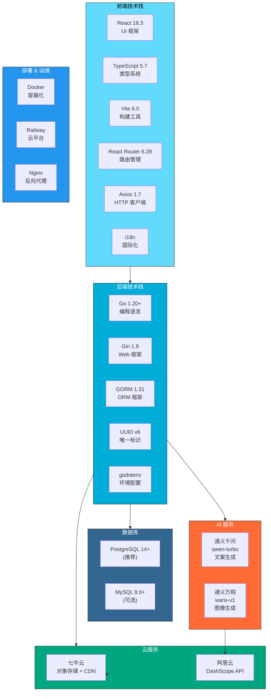
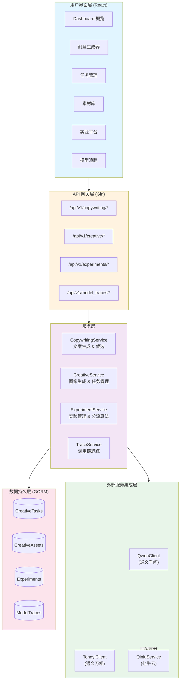
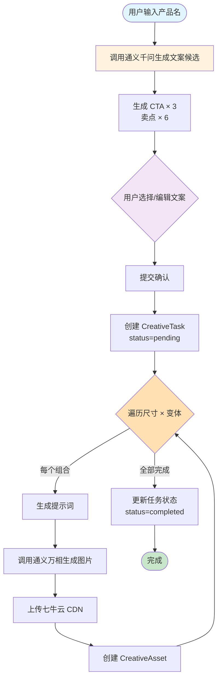
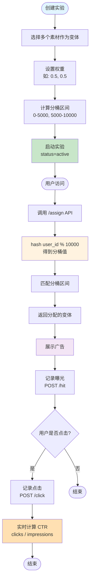
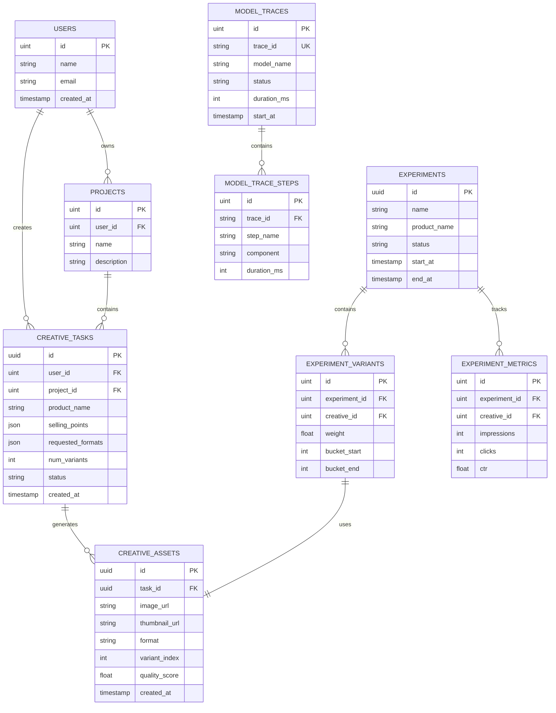
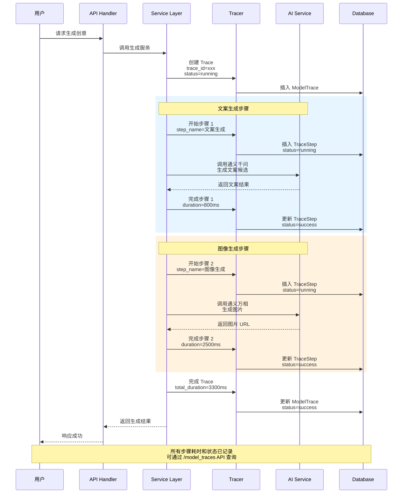
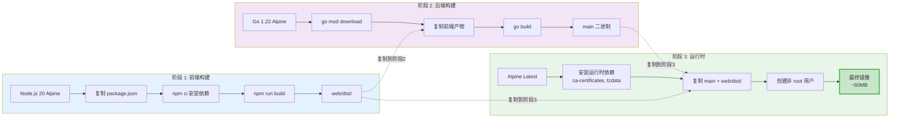

# 基于 LLM/VLM/文生图的广告创意全链路生成与实验平台

**Language / 语言**: [English](README.md) | 简体中文

基于阿里云通义万相和通义千问的智能广告创意生成平台，提供从文案生成到图像创作的完整工作流，支持 A/B 实验、模型追踪和插件化部署。

[](https://go.dev/)
[](https://reactjs.org/)
[](https://www.typescriptlang.org/)
[](https://www.postgresql.org/)


## 目录

- [核心功能](#核心功能)
- [技术架构](#技术架构)
- [系统架构](#系统架构)
- [项目结构](#项目结构)
- [快速开始](#快速开始)
- [环境配置](#环境配置)
- [部署指南](#部署指南)
- [API 接口](#api-接口)
- [开发指南](#开发指南)

## 核心功能

### 1. 智能创意生成工作流

完整的创意生成链路，从文案到图像一站式完成：

- **AI 文案生成** - 基于通义千问自动生成 CTA 和多个卖点候选
- **文案确认机制** - 用户选择或自定义文案后再启动图像生成
- **AI 图像生成** - 集成通义万相生成专业广告创意图
- **多尺寸支持** - 支持 1:1、9:16、16:9 等多种广告尺寸
- **变体生成** - 一次生成多个创意变体供选择和对比
- **自定义提示词** - 支持为每个变体定制不同的生成提示词和风格

### 2. A/B 实验平台

强大的实验管理和效果评估系统：

- **实验创建** - 从素材库选择创意创建对比实验
- **智能分流** - 基于用户 ID 哈希的分桶机制 (0-10000)
- **权重配置** - 灵活设置变体流量分配权重
- **实时指标** - 曝光量、点击量、CTR 实时统计
- **在线使用** - 通过 API 分配变体和记录指标
- **本地预览** - 支持嵌入式插件预览实验效果

### 3. 任务管理系统

完整的任务生命周期管理：

- **任务状态追踪** - pending → queued → processing → completed/failed
- **进度可视化** - 实时显示任务处理进度 (0-100%)
- **批量生成** - 支持同时生成多个尺寸和变体
- **任务删除** - 支持删除任务及关联素材
- **首图预览** - 任务列表快速预览首个生成的素材

### 4. 素材管理

集中化的创意素材库：

- **分页浏览** - 高效的分页加载机制
- **格式筛选** - 按尺寸 (1:1, 9:16, 16:9) 筛选素材
- **质量评分** - CTR 预测、NSFW 检测、综合质量评分
- **云端存储** - 自动上传七牛云 CDN
- **元数据管理** - 记录文案、卖点、生成参数等完整信息

### 5. 模型调用追踪

AI 模型调用的完整链路追踪：

- **调用链记录** - 记录每次 AI 模型调用的完整信息
- **步骤拆分** - 细化到文案生成、图像生成等各个步骤
- **性能监控** - 追踪每个步骤的耗时 (ms)
- **状态追踪** - success/failed/running 状态标记
- **输入输出预览** - 记录请求参数和响应结果预览
- **错误诊断** - 失败时记录详细错误信息

### 6. 插件化部署

支持嵌入第三方应用的插件系统：

- **独立组件** - `experiment-widget.js` 可嵌入任意网页
- **本地预览** - 插件预览页面模拟真实使用场景
- **动态加载** - 无需重新部署即可更新实验配置
- **国际化支持** - 中英文双语界面切换

## 技术架构

### 技术栈全景图

项目采用现代化全栈技术架构，前端 React + TypeScript，后端 Go + Gin，集成阿里云 AI 服务。



### 后端技术栈

```
Go 1.20+
├── Web 框架: Gin 1.9
├── ORM: GORM 1.31
├── 数据库驱动:
│   ├── gorm.io/driver/postgres (PostgreSQL)
│   └── gorm.io/driver/mysql (MySQL)
├── UUID: github.com/google/uuid
└── 环境配置: github.com/joho/godotenv
```

**核心依赖:**
- **Gin** - 高性能 HTTP Web 框架
- **GORM** - 强大的 ORM 库,支持多数据库
- **UUID v6** - 生成唯一标识符

### 前端技术栈

```
React 18.3 + TypeScript 5.7 + Vite 6.0
├── UI 框架: React 18.3.1
├── 类型系统: TypeScript 5.7.2
├── 构建工具: Vite 6.0.5
├── 路由管理: React Router 6.28.0
├── HTTP 客户端: Axios 1.7.9
└── 国际化: 自研 i18n 方案
```

**页面路由:**
- `/` - Dashboard 概览
- `/creative` - 创意生成器
- `/tasks` - 任务列表
- `/assets` - 素材库
- `/experiments` - 实验管理
- `/experiments/new` - 创建实验
- `/traces` - 模型追踪
- `/plugin-preview` - 插件预览

### 第三方服务

**AI 服务:**
- **阿里云通义万相 (wanx-v1)** - 文生图模型
- **阿里云通义千问 (qwen-turbo)** - 大语言模型

**云服务:**
- **七牛云对象存储** - CDN 加速的素材存储
- **PostgreSQL/MySQL** - 关系型数据库

## 系统架构

### 业务架构图

系统采用分层架构设计，从上到下依次为：用户界面层、API 网关层、服务层、外部服务集成层、数据持久层。



### 核心工作流

#### 1. 创意生成流程图

从文案生成到图像生成的完整工作流，包含用户确认环节和多变体并发生成机制。



#### 2. A/B 实验流程图

基于哈希分桶的流量分配机制，支持实时指标统计和 CTR 计算。



### 数据库设计

**核心数据表:**

```sql
-- 创意任务表
creative_tasks
├── id (UUID 主键)
├── user_id (用户 ID)
├── product_name (产品名称)
├── cta_text (CTA 文案)
├── selling_points (卖点数组 JSON)
├── cta_candidates (CTA 候选 JSON)
├── selling_point_candidates (卖点候选 JSON)
├── requested_formats (请求尺寸 JSON)
├── num_variants (变体数量)
├── variant_prompts (变体提示词 JSON)
├── variant_styles (变体风格 JSON)
├── status (任务状态)
├── progress (进度 0-100)
├── first_asset_url (首图预览)
└── timestamps (时间戳)

-- 创意素材表
creative_assets
├── id (UUID 主键)
├── task_id (任务 ID, 外键)
├── image_url (图片 URL)
├── thumbnail_url (缩略图 URL)
├── format (尺寸规格)
├── variant_index (变体索引)
├── prompt_used (生成提示词)
├── style_used (使用风格)
├── quality_score (质量评分)
├── predicted_ctr (预测 CTR)
├── nsfw_score (NSFW 评分)
└── timestamps

-- 实验表
experiments
├── id (UUID 主键)
├── name (实验名称)
├── product_name (产品名称)
├── status (实验状态: draft/active/paused/archived)
├── start_at (开始时间)
├── end_at (结束时间)
└── timestamps

-- 实验变体表
experiment_variants
├── id (自增主键)
├── experiment_id (实验 ID, 外键)
├── creative_id (素材 ID)
├── weight (权重 0-1)
├── bucket_start (分桶起始 0-10000)
├── bucket_end (分桶结束 0-10000)
├── title, product_name, image_url, cta_text, selling_points
└── timestamps

-- 实验指标表
experiment_metrics
├── id (自增主键)
├── experiment_id (实验 ID)
├── creative_id (素材 ID)
├── impressions (曝光数)
├── clicks (点击数)
├── ctr (点击率)
└── updated_at

-- 模型追踪表
model_traces
├── id (自增主键)
├── trace_id (追踪 ID, 唯一索引)
├── model_name (模型名称)
├── model_version (模型版本)
├── product_name (产品名称)
├── status (状态: success/failed/running)
├── duration_ms (耗时毫秒)
├── start_at, end_at (时间范围)
├── source (来源: experiment/task/user)
├── input_preview (输入预览)
├── output_preview (输出预览)
├── error_message (错误信息)
└── timestamps

-- 模型追踪步骤表
model_trace_steps
├── id (自增主键)
├── trace_id (追踪 ID, 外键)
├── step_name (步骤名称)
├── component (组件名称)
├── status (状态)
├── duration_ms (耗时毫秒)
├── start_at, end_at
├── input_preview, output_preview
├── error_message
├── extra (扩展信息 JSON)
└── timestamps
```

**索引策略:**
- `creative_tasks`: status, user_id, created_at
- `creative_assets`: task_id, format, created_at
- `experiments`: status, created_at
- `experiment_variants`: experiment_id, creative_id
- `experiment_metrics`: experiment_id, creative_id
- `model_traces`: trace_id (唯一), model_name, product_name, status

#### 数据库 ER 关系图

展示核心表之间的关联关系。



### 模型调用追踪时序图

展示 AI 模型调用的完整链路追踪流程，从请求发起到响应记录。



## 项目结构

```
ads-creative-gen-platform/
├── cmd/                          # 命令行工具
│   └── migrate/                 # 数据库迁移工具
│       └── main.go              # 迁移脚本入口
│
├── config/                      # 配置管理
│   ├── config.go                # 配置加载器
│   └── sql/                     # SQL 迁移文件
│
├── internal/                    # 内部包 (不对外暴露)
│   ├── handlers/                # HTTP 处理器 (Controller 层)
│   │   ├── creative_handler.go  # 创意生成接口
│   │   ├── experiment_handler.go # 实验管理接口
│   │   ├── trace_handler.go     # 模型追踪接口
│   │   └── dto.go               # 数据传输对象
│   │
│   ├── services/                # 业务逻辑层 (Service 层)
│   │   ├── copywriting_service.go  # 文案生成服务
│   │   ├── creative_service.go     # 创意生成服务
│   │   ├── experiment_service.go   # 实验管理服务
│   │   ├── qwen_client.go          # 通义千问客户端
│   │   ├── tongyi_client.go        # 通义万相客户端
│   │   ├── qiniu_service.go        # 七牛云服务
│   │   └── delete_task.go          # 任务删除服务
│   │
│   ├── models/                  # 数据模型 (Model 层)
│   │   ├── base.go              # 基础模型 (UUIDModel, Timestamps)
│   │   ├── creative.go          # 创意相关模型
│   │   ├── experiment.go        # 实验相关模型
│   │   ├── trace.go             # 追踪相关模型
│   │   ├── user.go              # 用户模型
│   │   ├── project.go           # 项目模型
│   │   └── tag.go               # 标签模型
│   │
│   ├── middleware/              # 中间件
│   │   └── cors.go              # CORS 跨域配置
│   │
│   └── tracing/                 # 追踪系统
│       ├── tracer.go            # 追踪器
│       └── trace_service.go     # 追踪服务
│
├── pkg/                         # 公共包 (可对外暴露)
│   └── database/                # 数据库连接层
│       └── database.go          # 数据库初始化
│
├── web/                         # React 前端项目
│   ├── src/
│   │   ├── pages/              # 页面组件
│   │   │   ├── DashboardPage.tsx          # 首页
│   │   │   ├── CreativeGeneratorPage.tsx  # 创意生成页
│   │   │   ├── TasksPage.tsx              # 任务列表页
│   │   │   ├── AssetsPage.tsx             # 素材库页
│   │   │   ├── ExperimentsPage.tsx        # 实验列表页
│   │   │   ├── ExperimentCreatePage.tsx   # 创建实验页
│   │   │   ├── TracePage.tsx              # 模型追踪页
│   │   │   └── PluginPreviewPage.tsx      # 插件预览页
│   │   │
│   │   ├── components/         # 可复用组件
│   │   ├── services/           # API 客户端
│   │   ├── types/              # TypeScript 类型定义
│   │   ├── i18n.tsx            # 国际化配置
│   │   ├── App.tsx             # 应用入口
│   │   └── main.tsx            # 渲染入口
│   │
│   ├── public/
│   │   └── experiment-widget.js # 实验插件脚本
│   │
│   ├── dist/                   # 构建产物 (由后端托管)
│   ├── package.json
│   ├── tsconfig.json
│   └── vite.config.js
│
├── docs/                       # 文档中心
│   ├── README.md               # 文档索引
│   ├── api-reference.md        # API 接口文档
│   ├── database.md             # 数据库设计文档
│   ├── database-schema.sql     # 数据库 Schema
│   ├── guides/                 # 指南文档
│   │   ├── development.md      # 开发指南
│   │   └── deployment.md       # 部署指南
│   └── design/                 # 功能设计文档
│       ├── copywriting-feature.md
│       ├── experiment-feature.md
│       ├── model-trace-page.md
│       └── plugin-widget.md
│
├── scripts/                    # 管理脚本
│   ├── start.sh               # 启动服务
│   ├── stop.sh                # 停止服务
│   └── status.sh              # 查看状态
│
├── main.go                    # 程序入口
├── Dockerfile                 # Docker 镜像配置 (多阶段构建)
├── .env.example              # 环境变量模板
├── go.mod                    # Go 依赖管理
└── go.sum                    # Go 依赖锁定
```

**目录设计原则:**
- **cmd/** - 可执行程序入口
- **internal/** - 私有代码,不对外暴露
- **pkg/** - 可复用的公共库
- **web/** - 前端项目,完全独立
- **docs/** - 项目文档集中管理
- **scripts/** - 运维脚本

## 快速开始

### 环境要求

**必需:**
- **Go**: 1.20 或更高版本
- **Node.js**: 18 或更高版本
- **数据库**: PostgreSQL 14+ 或 MySQL 8.0+

**可选:**
- **Docker**: 用于容器化部署
- **Make**: 用于运行 Makefile 命令

### 1. 克隆项目

```bash
git clone <your-repo-url>
cd ads-creative-gen-platform
```

### 2. 配置环境变量

```bash
# 复制环境变量模板
cp .env.example .env

# 编辑配置文件 (使用你喜欢的编辑器)
vim .env  # 或 nano .env
```

**必需配置项:**

```bash
# 应用配置
APP_MODE=debug              # debug: 开发模式, release: 生产模式
HTTP_PORT=:4000             # HTTP 服务端口

# 数据库配置 (PostgreSQL 示例)
DB_TYPE=postgres            # postgres 或 mysql
DB_HOST=localhost
DB_PORT=5432
DB_USER=postgres
DB_PASSWORD=your_password
DB_NAME=ads_creative_gen_platform
DB_CHARSET=utf8

# 通义 API 配置
TONGYI_API_KEY=sk-xxxxx    # 阿里云 DashScope API Key
TONGYI_IMAGE_MODEL=wanx-v1  # 图像生成模型
TONGYI_LLM_MODEL=qwen-turbo # 文案生成模型

# 七牛云配置
QINIU_ACCESS_KEY=your_access_key
QINIU_SECRET_KEY=your_secret_key
QINIU_BUCKET=your_bucket_name
QINIU_DOMAIN=               # 可选: 自定义域名
QINIU_PUBLIC_CLOUD_DOMAIN=  # 可选: 公有云域名
QINIU_REGION=cn-south-1     # 存储区域
QINIU_BASE_PATH=s3/         # 存储路径前缀
```

**获取 API Key:**
- **通义 API Key**: [阿里云 DashScope 控制台](https://dashscope.console.aliyun.com/)
- **七牛云密钥**: [七牛云密钥管理](https://portal.qiniu.com/user/key)

### 3. 初始化数据库

**PostgreSQL:**

```bash
# 创建数据库
psql -U postgres -c "CREATE DATABASE ads_creative_gen_platform;"

# 运行数据库迁移
go run cmd/migrate/main.go -action migrate

# (可选) 添加默认数据
go run cmd/migrate/main.go -action seed
```

**迁移命令说明:**
- `migrate` - 创建/更新表结构 (安全,不会删除数据)
- `seed` - 添加默认数据 (管理员账号、标签等)
- `reset` - ⚠️ 重置数据库 (删除所有数据并重新初始化)

### 4. 启动后端服务

```bash
# 安装 Go 依赖
go mod download

# 启动服务
go run main.go
```

成功后会显示:

```
🚀 Server starting on :4000
📖 API Docs: http://localhost:4000/api/v1/ping
💚 Health Check: http://localhost:4000/health
```

### 5. 构建并启动前端

**开发模式 (推荐):**

```bash
cd web

# 安装依赖
npm install

# 启动开发服务器 (热重载)
npm run dev
```

前端将运行在 `http://localhost:3001`

**生产模式:**

```bash
cd web

# 安装依赖
npm install

# 构建前端
npm run build
```

构建产物会生成到 `web/dist/`,然后访问后端服务 `http://localhost:4000` 即可。

### 6. 访问应用

**开发模式 (前后端分离):**
- 前端: http://localhost:3001
- 后端 API: http://localhost:4000/api/v1
- 健康检查: http://localhost:4000/health

**生产模式 (前后端一体化):**
- 应用首页: http://localhost:4000
- API 接口: http://localhost:4000/api/v1
- 健康检查: http://localhost:4000/health

### 7. 使用管理脚本 (可选)

项目提供了便捷的管理脚本:

```bash
# 启动服务 (自动检查数据库、运行迁移)
./scripts/start.sh

# 停止服务
./scripts/stop.sh

# 查看服务状态
./scripts/status.sh
```

## 环境配置

### 完整环境变量说明

```bash
# ==========================================
# 应用配置
# ==========================================
APP_MODE=debug              # debug: 开发模式, release: 生产模式
HTTP_PORT=:4000             # HTTP 服务端口 (格式: :端口号)

# ==========================================
# 数据库配置
# ==========================================
DB_TYPE=postgres            # 数据库类型: postgres 或 mysql
DB_HOST=localhost           # 数据库主机
DB_PORT=5432                # 数据库端口 (PostgreSQL: 5432, MySQL: 3306)
DB_USER=postgres            # 数据库用户名
DB_PASSWORD=your_password   # 数据库密码
DB_NAME=ads_creative_gen_platform  # 数据库名称
DB_CHARSET=utf8             # 字符集 (MySQL: utf8mb4, PostgreSQL: utf8)

# ==========================================
# 阿里云通义 API 配置
# ==========================================
TONGYI_API_KEY=sk-xxxxx     # DashScope API Key
TONGYI_IMAGE_MODEL=wanx-v1  # 图像生成模型: wanx-v1, wanx-lite-v1
TONGYI_LLM_MODEL=qwen-turbo # 文案生成模型: qwen-turbo, qwen-plus, qwen-max

# ==========================================
# 七牛云存储配置
# ==========================================
QINIU_ACCESS_KEY=your_access_key  # 七牛云 AccessKey
QINIU_SECRET_KEY=your_secret_key  # 七牛云 SecretKey
QINIU_BUCKET=your_bucket_name     # 存储空间名称
QINIU_DOMAIN=                     # 自定义 CDN 域名 (可选)
QINIU_PUBLIC_CLOUD_DOMAIN=        # 公有云默认域名 (可选)
QINIU_REGION=cn-south-1           # 存储区域: cn-south-1 (华南), cn-east-2 (华东)
QINIU_BASE_PATH=s3/               # 存储路径前缀
```

### 数据库切换

**使用 PostgreSQL (推荐):**

```bash
DB_TYPE=postgres
DB_HOST=localhost
DB_PORT=5432
DB_USER=postgres
DB_PASSWORD=postgres
DB_NAME=ads_creative_gen_platform
DB_CHARSET=utf8
```

## 部署指南

### 方式一: Docker 部署 (推荐)

项目提供了多阶段构建的 Dockerfile,可以实现前后端一体化部署。

**构建镜像:**

```bash
# 构建 Docker 镜像
docker build -t ads-creative-gen-platform:latest .

# 运行容器
docker run -d \
  --name ads-platform \
  -p 4000:4000 \
  --env-file .env \
  ads-creative-gen-platform:latest

# 查看日志
docker logs -f ads-platform
```

**Docker 多阶段构建流程图:**

展示前后端分离构建、最终整合为单一运行时镜像的完整流程。



**优势:**
- ✅ 镜像体积小 (~50MB)
- ✅ 安全性高 (非 root 用户)
- ✅ 自动多阶段构建
- ✅ 包含健康检查
- ✅ 前后端一体化部署

### 方式二: 云平台部署

#### Railway

Railway 是一个零配置的云部署平台。

```bash
# 1. 安装 Railway CLI
npm install -g @railway/cli

# 2. 登录
railway login

# 3. 初始化项目
railway init

# 4. 部署
railway up
```

#### Render

Render 支持从 Dockerfile 自动部署。

**步骤:**
1. 在 Render 创建新的 Web Service
2. 连接 GitHub 仓库
3. 选择 Dockerfile 构建
4. 配置环境变量
5. 点击部署


## API 接口

### 认证

当前版本暂未实现认证系统,所有接口均可直接访问。

### 基础接口

#### 健康检查

```http
GET /health
```

**响应:**

```json
{
  "status": "ok",
  "service": "ads-creative-platform"
}
```

#### Ping

```http
GET /api/v1/ping
```

**响应:**

```json
{
  "message": "pong"
}
```

### 文案生成接口

#### 生成文案候选

```http
POST /api/v1/copywriting/generate
Content-Type: application/json

{
  "product_name": "夏季清凉T恤"
}
```

**响应:**

```json
{
  "cta_candidates": [
    "立即抢购",
    "马上购买",
    "限时特惠"
  ],
  "selling_point_candidates": [
    "纯棉透气，清凉一夏",
    "吸汗速干，舒适无痕",
    "经典设计，百搭时尚",
    "精选面料，亲肤柔软",
    "夏日必备，清爽随行",
    "多色可选，彰显个性"
  ]
}
```

#### 确认文案并启动创意生成

```http
POST /api/v1/copywriting/confirm
Content-Type: application/json

{
  "product_name": "夏季清凉T恤",
  "cta": "立即抢购",
  "selling_point": "纯棉透气，清凉一夏",
  "requested_formats": ["1:1", "9:16", "16:9"],
  "num_variants": 3,
  "selected_cta_index": 0,
  "selected_sp_indexes": [0, 1]
}
```

**响应:**

```json
{
  "task_id": "550e8400-e29b-41d4-a716-446655440000",
  "status": "pending",
  "message": "任务已创建,开始生成创意"
}
```

### 创意生成接口

#### 直接生成创意 (跳过文案生成)

```http
POST /api/v1/creative/generate
Content-Type: application/json

{
  "title": "夏季T恤促销",
  "product_name": "夏季清凉T恤",
  "selling_points": ["纯棉透气", "吸汗速干"],
  "cta_text": "立即抢购",
  "requested_formats": ["1:1", "9:16"],
  "num_variants": 2
}
```

**响应:**

```json
{
  "task_id": "550e8400-e29b-41d4-a716-446655440000",
  "status": "pending"
}
```

#### 查询任务状态

```http
GET /api/v1/creative/task/{task_id}
```

**响应:**

```json
{
  "id": "550e8400-e29b-41d4-a716-446655440000",
  "title": "夏季T恤促销",
  "product_name": "夏季清凉T恤",
  "status": "completed",
  "progress": 100,
  "requested_formats": ["1:1", "9:16"],
  "num_variants": 2,
  "first_asset_url": "https://cdn.example.com/xxx.jpg",
  "assets": [
    {
      "id": "asset-uuid-1",
      "image_url": "https://cdn.example.com/xxx.jpg",
      "thumbnail_url": "https://cdn.example.com/xxx_thumb.jpg",
      "format": "1:1",
      "variant_index": 0,
      "quality_score": 0.85,
      "predicted_ctr": 0.12
    }
  ],
  "created_at": "2024-12-15T10:00:00Z",
  "completed_at": "2024-12-15T10:02:30Z"
}
```

**任务状态:**
- `draft` - 草稿 (仅文案生成)
- `pending` - 待处理
- `queued` - 已排队
- `processing` - 处理中
- `completed` - 已完成
- `failed` - 失败
- `cancelled` - 已取消

#### 获取任务列表

```http
GET /api/v1/creative/tasks?page=1&page_size=10
```

**响应:**

```json
{
  "tasks": [...],
  "pagination": {
    "page": 1,
    "page_size": 10,
    "total": 50
  }
}
```

#### 删除任务

```http
DELETE /api/v1/creative/task/{task_id}
```

**响应:**

```json
{
  "message": "任务及关联素材已删除"
}
```

### 素材管理接口

#### 获取素材列表

```http
GET /api/v1/creative/assets?page=1&page_size=20&format=1:1
```

**查询参数:**
- `page` - 页码 (默认 1)
- `page_size` - 每页数量 (默认 20)
- `format` - 尺寸筛选 (可选: 1:1, 9:16, 16:9)

**响应:**

```json
{
  "assets": [...],
  "pagination": {
    "page": 1,
    "page_size": 20,
    "total": 100
  }
}
```

### 实验管理接口

#### 创建实验

```http
POST /api/v1/experiments
Content-Type: application/json

{
  "name": "夏季T恤广告测试",
  "product_name": "夏季清凉T恤",
  "variants": [
    {
      "creative_id": 1,
      "weight": 0.5
    },
    {
      "creative_id": 2,
      "weight": 0.5
    }
  ]
}
```

**响应:**

```json
{
  "id": "exp-uuid",
  "name": "夏季T恤广告测试",
  "status": "draft",
  "variants": [
    {
      "id": 1,
      "creative_id": 1,
      "weight": 0.5,
      "bucket_start": 0,
      "bucket_end": 5000
    },
    {
      "id": 2,
      "creative_id": 2,
      "weight": 0.5,
      "bucket_start": 5000,
      "bucket_end": 10000
    }
  ]
}
```

#### 获取实验列表

```http
GET /api/v1/experiments?page=1&page_size=10
```

#### 更新实验状态

```http
POST /api/v1/experiments/{id}/status
Content-Type: application/json

{
  "status": "active"
}
```

**状态值:**
- `draft` - 草稿
- `active` - 运行中
- `paused` - 已暂停
- `archived` - 已归档

#### 分配变体 (分流)

```http
GET /api/v1/experiments/{id}/assign?user_id=user123
```

**响应:**

```json
{
  "variant_id": 1,
  "creative_id": 1,
  "title": "夏季清凉T恤",
  "product_name": "夏季清凉T恤",
  "image_url": "https://cdn.example.com/xxx.jpg",
  "cta_text": "立即抢购",
  "selling_points": ["纯棉透气", "吸汗速干"]
}
```

**分流算法:**
```
bucket = hash(user_id) % 10000
匹配 bucket_start <= bucket < bucket_end 的变体
```

#### 记录曝光

```http
POST /api/v1/experiments/{id}/hit
Content-Type: application/json

{
  "user_id": "user123",
  "variant_id": 1
}
```

**响应:**

```json
{
  "message": "曝光已记录"
}
```

#### 记录点击

```http
POST /api/v1/experiments/{id}/click
Content-Type: application/json

{
  "user_id": "user123",
  "variant_id": 1
}
```

**响应:**

```json
{
  "message": "点击已记录"
}
```

#### 查看实验指标

```http
GET /api/v1/experiments/{id}/metrics
```

**响应:**

```json
{
  "experiment_id": "exp-uuid",
  "metrics": [
    {
      "creative_id": 1,
      "impressions": 10000,
      "clicks": 500,
      "ctr": 0.05
    },
    {
      "creative_id": 2,
      "impressions": 10000,
      "clicks": 600,
      "ctr": 0.06
    }
  ]
}
```

### 模型追踪接口

#### 获取追踪列表

```http
GET /api/v1/model_traces?page=1&page_size=10
```

**响应:**

```json
{
  "traces": [...],
  "pagination": {
    "page": 1,
    "page_size": 10,
    "total": 50
  }
}
```

#### 获取追踪详情

```http
GET /api/v1/model_traces/{id}
```

**响应:**

```json
{
  "id": 1,
  "trace_id": "trace-uuid",
  "model_name": "通义千问",
  "model_version": "qwen-turbo",
  "product_name": "夏季清凉T恤",
  "status": "success",
  "duration_ms": 1500,
  "start_at": "2024-12-15T10:00:00Z",
  "end_at": "2024-12-15T10:00:01.5Z",
  "steps": [
    {
      "step_name": "文案生成",
      "component": "QwenClient",
      "status": "success",
      "duration_ms": 800,
      "input_preview": "产品名称: 夏季清凉T恤",
      "output_preview": "CTA: 立即抢购; 卖点: ..."
    }
  ]
}
```

## 开发指南

### 后端开发

#### 项目结构约定

- **handlers/** - 仅负责 HTTP 请求/响应处理,不包含业务逻辑
- **services/** - 核心业务逻辑层,可被多个 handler 复用
- **models/** - 数据模型定义,使用 GORM 标签
- **pkg/** - 可复用的公共库 (如数据库连接)

#### 添加新接口

**1. 定义数据模型 (internal/models/)**

```go
package models

type MyModel struct {
    UUIDModel
    Name   string `gorm:"type:varchar(255);not null" json:"name"`
    Status string `gorm:"type:varchar(20);default:'active'" json:"status"`
}

func (MyModel) TableName() string {
    return "my_models"
}
```

**2. 创建服务层 (internal/services/)**

```go
package services

type MyService struct {
    db *gorm.DB
}

func NewMyService() *MyService {
    return &MyService{db: database.DB}
}

func (s *MyService) Create(data *models.MyModel) error {
    return s.db.Create(data).Error
}
```

**3. 创建处理器 (internal/handlers/)**

```go
package handlers

type MyHandler struct {
    service *services.MyService
}

func NewMyHandler() *MyHandler {
    return &MyHandler{
        service: services.NewMyService(),
    }
}

func (h *MyHandler) Create(c *gin.Context) {
    var req dto.CreateMyModelRequest
    if err := c.ShouldBindJSON(&req); err != nil {
        c.JSON(400, gin.H{"error": err.Error()})
        return
    }

    // 调用服务层
    model := &models.MyModel{Name: req.Name}
    if err := h.service.Create(model); err != nil {
        c.JSON(500, gin.H{"error": err.Error()})
        return
    }

    c.JSON(200, model)
}
```

**4. 注册路由 (main.go)**

```go
myHandler := handlers.NewMyHandler()
v1.POST("/my-models", myHandler.Create)
v1.GET("/my-models/:id", myHandler.Get)
```

#### 数据库迁移

**自动迁移 (开发环境):**

在 `pkg/database/database.go` 中添加模型:

```go
func InitializeDatabase() {
    // ...
    DB.AutoMigrate(
        &models.MyModel{}, // 添加新模型
    )
}
```

**手动迁移 (生产环境):**

在 `cmd/migrate/main.go` 中添加:

```go
func migrate() {
    database.DB.AutoMigrate(&models.MyModel{})
    log.Println("✅ MyModel table migrated")
}
```

然后运行:

```bash
go run cmd/migrate/main.go -action migrate
```

### 前端开发

#### 项目结构约定

- **pages/** - 页面组件 (一个路由对应一个页面)
- **components/** - 可复用组件
- **services/** - API 客户端封装
- **types/** - TypeScript 类型定义

#### 添加新页面

**1. 创建页面组件 (src/pages/MyPage.tsx)**

```tsx
import React from 'react';

const MyPage: React.FC = () => {
  return (
    <div>
      <h1>My Page</h1>
    </div>
  );
};

export default MyPage;
```

**2. 注册路由 (src/App.tsx)**

```tsx
import MyPage from './pages/MyPage';

<Routes>
  <Route path="/my-page" element={<MyPage />} />
</Routes>
```

#### API 调用

**1. 定义类型 (src/types/index.ts)**

```typescript
export interface MyModel {
  id: string;
  name: string;
  status: string;
  created_at: string;
}
```

**2. 创建 API 服务 (src/services/api.ts)**

```typescript
import axios from 'axios';
import { MyModel } from '../types';

const API_BASE = '/api/v1';

export const myApi = {
  create: async (data: { name: string }): Promise<MyModel> => {
    const res = await axios.post(`${API_BASE}/my-models`, data);
    return res.data;
  },

  get: async (id: string): Promise<MyModel> => {
    const res = await axios.get(`${API_BASE}/my-models/${id}`);
    return res.data;
  },
};
```

**3. 在组件中使用**

```tsx
import { useEffect, useState } from 'react';
import { myApi } from '../services/api';
import { MyModel } from '../types';

const MyPage: React.FC = () => {
  const [data, setData] = useState<MyModel | null>(null);

  useEffect(() => {
    myApi.get('some-id').then(setData);
  }, []);

  return <div>{data?.name}</div>;
};
```

#### 国际化

使用项目内置的 i18n 系统:

```tsx
import { useI18n } from '../i18n';

const MyComponent: React.FC = () => {
  const { t, setLanguage } = useI18n();

  return (
    <div>
      <h1>{t('myPage.title')}</h1>
      <button onClick={() => setLanguage('en')}>English</button>
      <button onClick={() => setLanguage('zh')}>中文</button>
    </div>
  );
};
```

在 `src/i18n.tsx` 中添加翻译:

```typescript
const translations = {
  zh: {
    myPage: {
      title: '我的页面',
    },
  },
  en: {
    myPage: {
      title: 'My Page',
    },
  },
};
```

### 代码规范

**Go 代码规范:**
- 遵循 [Effective Go](https://golang.org/doc/effective_go.html)
- 使用 `gofmt` 格式化代码
- 导出函数和类型添加注释
- 错误处理不要忽略

**TypeScript 代码规范:**
- 使用严格模式 (`strict: true`)
- 组件使用函数式组件 + Hooks
- 避免使用 `any`,尽量定义类型
- 使用 ESLint 和 Prettier 格式化

### 测试

**后端测试:**

```bash
# 运行所有测试
go test ./...

# 运行特定包的测试
go test ./internal/services

# 带覆盖率
go test -cover ./...
```

**前端测试:**

```bash
cd web

# 类型检查
npx tsc --noEmit

# (可选) 添加单元测试框架如 Vitest
npm run test
```

### 常见问题

#### 1. 数据库连接失败

**问题:** 启动时提示数据库连接失败

**解决:**
```bash
# 检查数据库是否运行
# PostgreSQL
pg_isready

# MySQL
mysqladmin ping

# 检查环境变量
cat .env | grep DB_

# 测试连接
psql -h localhost -U postgres -d ads_creative_gen_platform
```

#### 2. 前端访问 404

**问题:** 访问前端页面返回 404

**解决:**
```bash
# 确保前端已构建
cd web && npm run build

# 检查 dist 目录
ls -la web/dist/

# 重启后端
go run main.go
```

#### 3. 通义 API 调用失败

**问题:** 生成创意时报错 "API Key invalid"

**解决:**
```bash
# 检查 API Key
echo $TONGYI_API_KEY

# 验证 API Key 是否有效
curl -X POST 'https://dashscope.aliyuncs.com/api/v1/services/aigc/text-generation/generation' \
  -H "Authorization: Bearer $TONGYI_API_KEY" \
  -H 'Content-Type: application/json' \
  -d '{
    "model": "qwen-turbo",
    "input": {"prompt": "你好"},
    "parameters": {}
  }'
```

#### 4. 七牛云上传失败

**问题:** 图片生成后上传七牛云失败

**解决:**
```bash
# 检查七牛云配置
cat .env | grep QINIU_

# 确保 Bucket 存在且有权限
# 检查存储区域配置是否正确 (cn-south-1, cn-east-2 等)
# 检查 AccessKey/SecretKey 是否正确
```

#### 5. CORS 跨域错误

**问题:** 前端开发模式下 API 调用报 CORS 错误

**解决:**

后端已配置 CORS 中间件 (`internal/middleware/cors.go`),但如果仍有问题:

```go
// internal/middleware/cors.go
func CORSMiddleware() gin.HandlerFunc {
    return func(c *gin.Context) {
        c.Writer.Header().Set("Access-Control-Allow-Origin", "*")
        c.Writer.Header().Set("Access-Control-Allow-Methods", "GET, POST, PUT, DELETE, OPTIONS")
        c.Writer.Header().Set("Access-Control-Allow-Headers", "Content-Type, Authorization")

        if c.Request.Method == "OPTIONS" {
            c.AbortWithStatus(204)
            return
        }

        c.Next()
    }
}
```

## 性能优化

### 后端优化

- **数据库索引**: 已为常用查询字段添加索引
- **连接池**: GORM 自动管理数据库连接池
- **并发控制**: 使用 Goroutine 处理多变体生成

### 前端优化

- **代码分割**: Vite 自动进行代码分割
- **懒加载**: 可为大组件添加 `React.lazy()`
- **图片优化**: 使用七牛云 CDN + 缩略图

## 安全性

### 当前安全措施

- **CORS 配置**: 防止未授权的跨域访问
- **输入验证**: 使用 GORM 参数化查询防止 SQL 注入
- **非 root 用户**: Docker 容器使用非特权用户运行
- **环境变量**: 敏感信息通过环境变量管理

### 待实现

- [ ] 用户认证 (JWT)
- [ ] API 限流
- [ ] HTTPS 强制
- [ ] 请求签名验证

## 路线图

### 已完成

- [x] 基础创意生成功能
- [x] 文案生成工作流
- [x] A/B 实验平台
- [x] 模型调用追踪
- [x] 国际化支持 (中英文)
- [x] 插件系统

### 进行中

- [ ] 用户认证系统
- [ ] 素材评分系统完善
- [ ] 批量导出功能

### 计划中

- [ ] 更多 AI 模型支持
- [ ] 实验报告自动生成
- [ ] Webhook 通知
- [ ] API 文档自动生成
